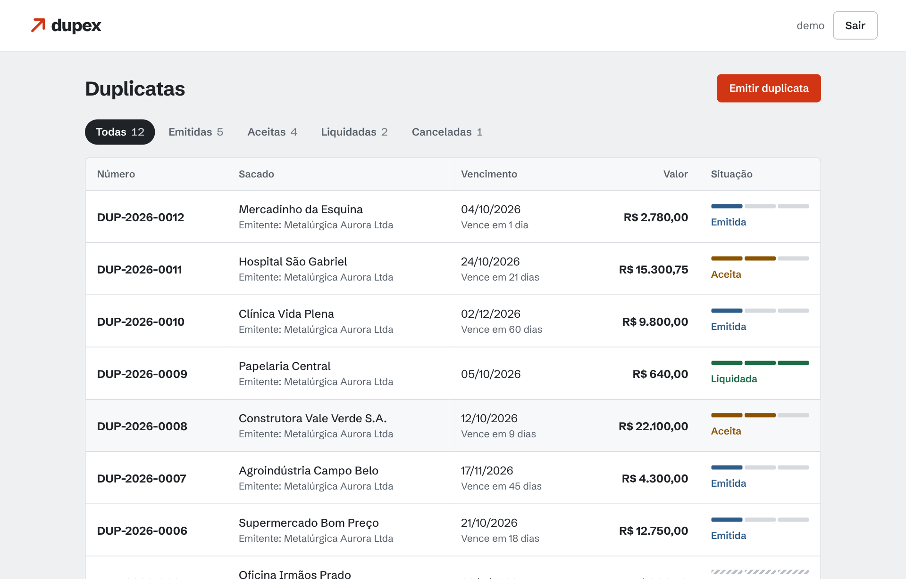
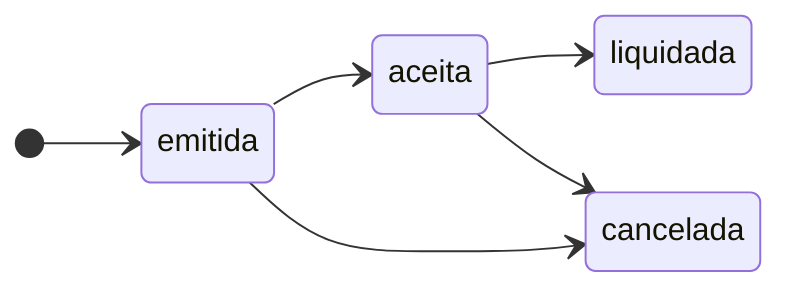
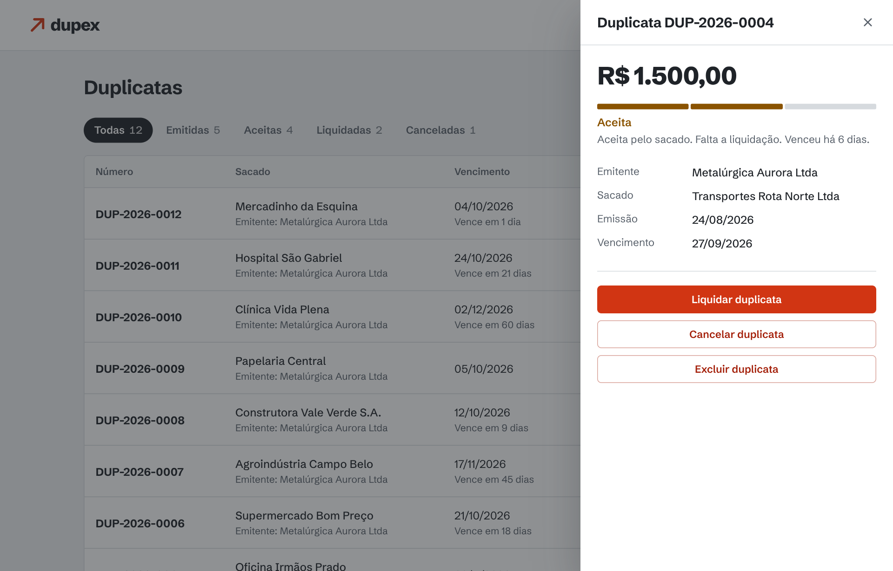
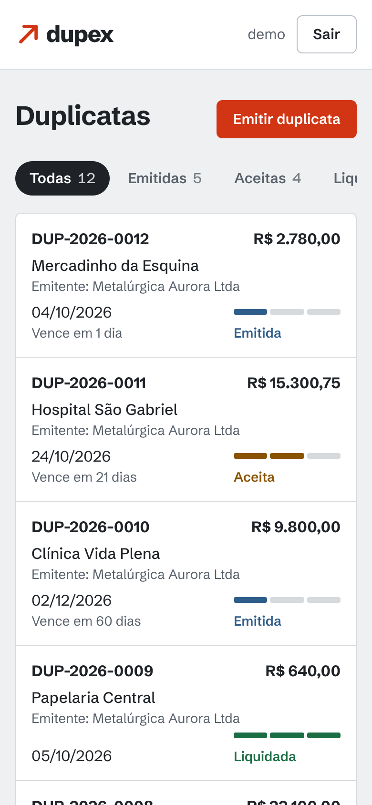

# Dupex

[](https://github.com/mxndex7/Dupex/actions/workflows/ci.yml)


API RESTful para **duplicatas escriturais**: emissão, aceite e liquidação de títulos de crédito em formato digital, com autenticação JWT, migrações de banco, testes automatizados e um painel web incluído.



## O que é uma duplicata escritural

A duplicata escritural é a versão digital do título de crédito: em vez de um papel, ela nasce e vive em um registro eletrônico. Para a empresa, isso comprova o direito de recebimento e facilita a antecipação de recebíveis. Para o mercado, o registro único evita a fraude clássica de vender a mesma fatura para vários bancos.

O Dupex modela o ciclo de vida desse título: a empresa **emite**, o cliente (sacado) **aceita** e, por fim, a duplicata é **liquidada**. Também pode ser **cancelada** antes disso.

> Este é um projeto de estudo. Ele não se integra a entidades registradoras nem tem validade jurídica.



## Funcionalidades

- CRUD de duplicatas com filtro por status e paginação
- Cadastro e login com **JWT** (senhas com bcrypt)
- **Isolamento por usuário**: cada pessoa só enxerga e altera as próprias duplicatas
- Validação de entrada com Pydantic (valor positivo com até 2 casas, vencimento não pode estar no passado)
- Valores monetários guardados em **centavos inteiros**, sem erro de ponto flutuante
- Migrações com Alembic e documentação interativa (Swagger) em `/docs`
- Painel web responsivo e acessível, servido pela própria API

<p>
  
  
</p>

## Como executar

### Localmente

```bash
git clone https://github.com/mxndex7/Dupex.git
cd Dupex

python -m venv .venv
source .venv/bin/activate        # Windows: .venv\Scripts\activate
pip install -r requirements.txt

cp .env.example .env             # opcional: defina DUPEX_SECRET_KEY
uvicorn app.main:app --reload
```

Abra <http://localhost:8000> para o painel ou <http://localhost:8000/docs> para o Swagger. O banco SQLite (`data/dupex.db`) e as migrações são criados na primeira execução.

### Com Docker

```bash
cp .env.example .env
# edite o .env e preencha DUPEX_SECRET_KEY (o comando para gerar está no arquivo)
docker compose up --build
```

Os dados ficam em um volume (`dupex-data`) e sobrevivem a reinícios do contêiner.

## Usando a API

```bash
# 1. criar conta e pegar o token
curl -X POST localhost:8000/api/v1/auth/register \
  -H 'Content-Type: application/json' \
  -d '{"username": "rafael", "password": "senha-segura-123"}'

TOKEN=$(curl -s -X POST localhost:8000/api/v1/auth/token \
  -d 'username=rafael&password=senha-segura-123' \
  | python -c "import sys, json; print(json.load(sys.stdin)['access_token'])")

# 2. emitir uma duplicata
curl -X POST localhost:8000/api/v1/duplicatas \
  -H "Authorization: Bearer $TOKEN" \
  -H 'Content-Type: application/json' \
  -d '{
        "numero": "DUP-001",
        "valor": "1500.00",
        "emitente": "Empresa XYZ Ltda",
        "sacado": "Cliente ABC S.A.",
        "data_vencimento": "2030-12-31"
      }'

# 3. registrar o aceite
curl -X PATCH localhost:8000/api/v1/duplicatas/1/status \
  -H "Authorization: Bearer $TOKEN" \
  -H 'Content-Type: application/json' \
  -d '{"status": "aceita"}'
```

### Endpoints

| Método | Rota | Auth | Descrição |
| --- | --- | :-: | --- |
| `GET` | `/health` | | Saúde do serviço e do banco |
| `POST` | `/api/v1/auth/register` | | Cria uma conta |
| `POST` | `/api/v1/auth/token` | | Login (formulário `username` e `password`) |
| `GET` | `/api/v1/auth/me` | ✓ | Usuário autenticado |
| `POST` | `/api/v1/duplicatas` | ✓ | Emite uma duplicata |
| `GET` | `/api/v1/duplicatas` | ✓ | Lista (`status`, `limit` de 1 a 100, `offset`) |
| `GET` | `/api/v1/duplicatas/{id}` | ✓ | Busca por id |
| `PATCH` | `/api/v1/duplicatas/{id}/status` | ✓ | Atualiza o status |
| `DELETE` | `/api/v1/duplicatas/{id}` | ✓ | Exclui |

A listagem devolve `{ "items": [...], "total": 42, "limit": 20, "offset": 0 }`. Valores monetários trafegam como string (`"1500.00"`) para não perder precisão no cliente. Erros seguem o formato `{ "detail": "..." }`, e erros de validação trazem o campo e o motivo (HTTP 422).

## Decisões técnicas

- **Camadas separadas.** Rotas só tratam HTTP, os serviços guardam as regras de negócio e os modelos cuidam da persistência. Dá para testar cada parte sem as outras.
- **Dinheiro em centavos.** `float` não representa `19.99` com exatidão. O banco guarda um inteiro e a API converte de e para `Decimal`.
- **404 em vez de 403.** Pedir a duplicata de outro usuário responde "não encontrada", igual a um id inexistente, para não revelar que o recurso existe.
- **Login sem vazar informação.** Usuário inexistente e senha errada dão a mesma resposta e gastam o mesmo tempo (hash bcrypt descartável).
- **Migrações versionadas.** O schema só muda por Alembic, e um teste falha se um modelo for alterado sem a migração correspondente.
- **Segredos por variável de ambiente.** Sem `DUPEX_SECRET_KEY` a API gera uma chave temporária e avisa no log. No Docker Compose a chave é obrigatória.
- **Front sem dependências.** HTML, CSS e JS puros, fonte hospedada localmente e texto da API sempre inserido via `textContent`, sem `innerHTML`.

## Estrutura

```
dupex/
├─ app/
│  ├─ api/            # rotas (routers/) e dependências (autenticação, sessão)
│  ├─ core/           # configuração, banco, segurança (JWT/bcrypt), erros
│  ├─ models/         # tabelas SQLAlchemy
│  ├─ schemas/        # validação de entrada e saída (Pydantic)
│  ├─ services/       # regras de negócio
│  ├─ static/         # painel web
│  └─ main.py
├─ migrations/        # Alembic
├─ tests/
├─ docs/screenshots/
├─ Dockerfile
└─ docker-compose.yml
```

## Testes e qualidade

```bash
pip install -r requirements-dev.txt
pytest                 # testes de autenticação, CRUD, validação, isolamento e migrações
ruff check . && ruff format --check .
```

O CI (GitHub Actions) roda lint e testes em Python 3.11, 3.12 e 3.13 e faz o build da imagem Docker.

## Limitações conhecidas e próximos passos

- [ ] **Máquina de estados.** O ciclo acima é só o esperado: hoje a API aceita qualquer transição (por exemplo, de `liquidada` de volta para `emitida`). O painel já oferece só os próximos passos válidos.
- [ ] **Cancelar em vez de excluir**, com histórico de quem mudou o quê e quando.
- [ ] **CNPJ** validado para emitente e sacado, e vínculo com nota fiscal.
- [ ] **Rate limiting** nas rotas de login e cadastro.
- [ ] **Token em cookie `HttpOnly`.** O painel guarda o JWT em `sessionStorage`, que é prático mas exposto a XSS. Não há refresh token.
- [ ] Mensagens de validação da API em português (hoje o painel as traduz no cliente).
